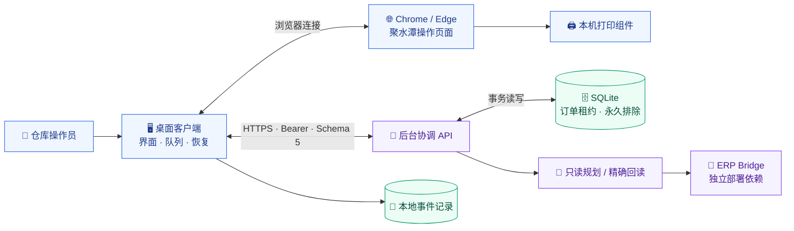
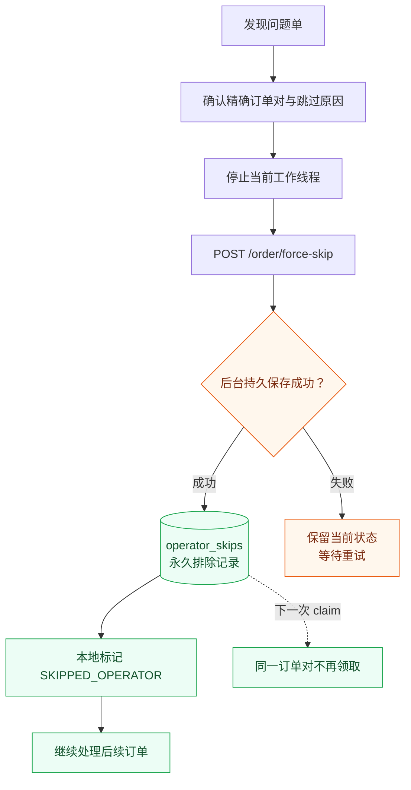
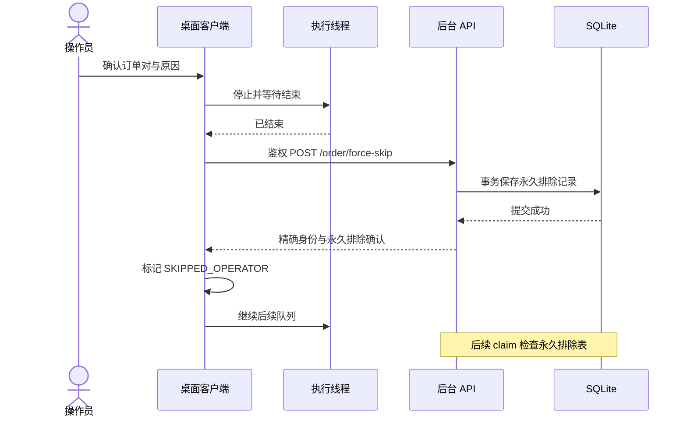
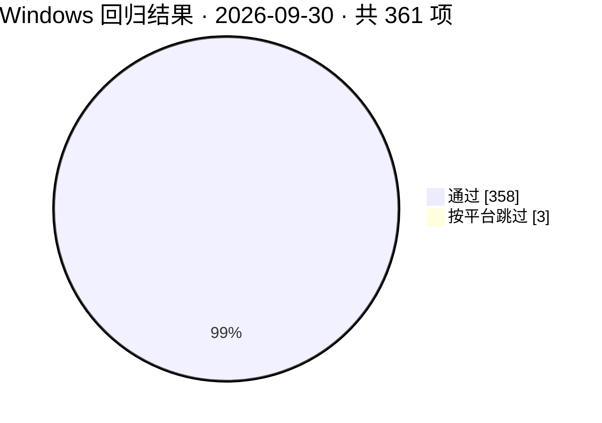

> 当前工作分支已支持单台电脑无需协调服务器运行。默认配置模板使用 `backend_mode=local`，查询、任务预留和永久跳过均在本机完成。聚水潭查询凭据需在本机另行配置。
> 详见 [单机版使用说明](client/单机版使用说明.md)。下文后台部署相关内容保留为旧版资料。

<div align="center">


# 🖨️ 聚水潭安全打单助手

**让订单有序流转，让异常有据可查。**

桌面操作 · 后台协调 · 批量打单 · 永久跳过 · 审计记录


[](LICENSE)

[✨ 功能](#features) · [🧭 架构](#architecture) · [⏭️ 强制跳过](#force-skip) · [🚀 上手](#quick-start) · [🧪 验证](#verification) · [📚 文档](#documents)

</div>

---

> [!TIP]
> **2026-09-30 更新：强制跳过问题单。** 支持任意暂停类型，后台永久保存订单对和原因，后续领取时自动排除；不受旧异常白名单、有效租约或本机 200 条排除上限限制。

<a id="features"></a>

## ✨ 功能一览

| | 能力 | 实际行为 |
| :---: | --- | --- |
| 🖥️ | **桌面操作台** | 选择面单类型，控制开始、暂停、继续和停止，查看运行事件 |
| 📦 | **批量打单** | 同类订单组成最多 **10 单**的打印批次，执行前核对精确订单身份 |
| 🔐 | **后台租约协调** | 先分配订单租约，避免不同工作站同时处理同一订单对 |
| 🔎 | **精确回读与恢复** | 区分打印请求、打印动作和订单终态，处理执行结果不确定的任务 |
| ⏭️ | **强制跳过问题单** | 手动确认后写入后台永久排除表，再更新本地任务并继续 |
| 🏷️ | **外部系统订单过滤** | 默认关闭；启用后按标签识别，在领取及业务动作前复核 |
| 📊 | **SKU 出库导出** | 按选定日期导出 SKU 出库明细，便于后续汇总 |
| 🧾 | **运行记录** | 本地 SQLite / JSONL 保存事件，后台保存跳过原因、工作站和时间 |
| 🛠️ | **交付工具链** | SHA256 锁定依赖、离线自检、打包校验及 Inno Setup 安装定义 |

<a id="architecture"></a>

## 🧭 系统架构

📁 **[client/ 本地客户端](client/)** · **[server/ 服务器端](server/)**

本地运行与打包文件集中在 `client/`，后台代码与部署模板集中在 `server/`。



客户端负责桌面和浏览器操作；后台负责候选规划、租约、精确回读及永久排除。ERP bridge 和它的凭据需单独部署。

<a id="force-skip"></a>

## ⏭️ 强制跳过问题单

**按钮：`强制跳过异常单并继续`**

每次操作以 **内部订单号 `o_id` + 出库单号 `io_id`** 确认目标。支持任意暂停类型，包括完成证据不足；无需有效租约或打印完成证明。



| 规则 | 处理方式 |
| --- | --- |
| **排除范围** | 同一后台服务中的精确订单对，后续领取时持续排除 |
| **审计记录** | 保存订单对、工作站、原因及时间；重复请求保留首次记录 |
| **服务重启** | 记录保存在 SQLite 中，重启后继续生效 |
| **超过 200 条** | 后台永久排除表独立于本机请求中的排除列表 |
| **已有完成记录** | 保留原完成原因，另存永久排除记录 |
| **网络或后台失败** | 不标记本地跳过成功，不自动恢复执行 |

> [!IMPORTANT]
> 强制跳过不会撤销已发生的取号、打印或其他业务动作，也不会把跳过当作打印完成证明。必须确认明确的订单身份，并成功写入后台后才会继续。

<details>
<summary><b>🔬 展开查看客户端与后台交互</b></summary>



完整接口：`POST /jst-print-api/v1/order/force-skip`。

请求字段：`workstation_id`、`o_id`、`io_id`、`reason`。

详细说明见 [强制跳过更新说明](docs/force-skip-20260930.md)。

</details>

<a id="quick-start"></a>

## 🚀 快速上手

### ① 准备配置

在仓库根目录进入 `client/`，复制示例文件，填入自己的 HTTPS 后台地址和 token：

```powershell
cd client
Copy-Item jst_operator_config.example.json jst_operator_config.json
```

```json
{
  "api_url": "https://your-backend.example.com/jst-print-api/v1",
  "api_token": "YOUR_OWN_BACKEND_TOKEN",
  "debug_port": 9222,
  "loop_seconds": 5
}
```

客户端与后台使用同一 token。实际 token 为 **32–128 字符**，仅使用英文字母、数字、下划线和连字符；上面的值是占位符。

### ② 源码启动

Windows x64 使用 **CPython 3.10 64 位**，确保提供 `py.exe`，然后双击：

```text
Win10_21H1_源码直接启动.bat
```

脚本使用带 SHA256 的版本锁文件安装依赖。正式连接前，需准备匹配后台、Chrome / Edge 和打印组件，并确认仓库、店铺和承运商规则适用于目标环境。

### ③ 离线自检

```sh
python jst_auto_print_app.py --self-test --self-test-output self-test.json
```

Windows 也可双击 `Win10_离线自检.bat`。

> [!WARNING]
> “不打印试运行”仍可能执行改快递及获取电子面单号，应只用于已批准的验收订单。离线自检和回归测试不替代真实订单及实体纸张验收。

<a id="verification"></a>

## 🧪 验证记录

**验证日期：2026-09-30。** 徽章和图表记录本次交付检查结果，并非持续运行的 CI 状态。

| 验证项 | 结果 | 范围 |
| --- | :---: | --- |
| macOS 回归 | ✅ **361 / 361** | 离线回归全部通过 |
| Windows 回归 | ✅ **358 通过 · 3 跳过** | 共 361 项，按平台跳过 3 项 |
| Windows x64 Setup | ✅ **通过** | 构建、安装及安装后自检 |
| 强制跳过真实订单 | ⬜ **未执行** | 尚需现场验收 |
| 实体打印 | ⬜ **未执行本次验收** | 尚需现场验收 |



**新增 / 更新覆盖场景**

`任意暂停类型` · `RUNNING 状态` · `无租约` · `跨工作站` · `服务重启` · `超过 200 条` · `身份变化` · `后台失败` · `保留完成证据` · `HTTP 鉴权`

在 `client/` 目录运行客户端与服务端离线回归：

```sh
python -m unittest discover -s tests -p 'test_*.py'
```

## 🛠️ 构建与交付

| 目标 | 入口 | 说明 |
| --- | --- | --- |
| Windows x64 | [`build_jst_auto_print_win10_x64.bat`](client/build_jst_auto_print_win10_x64.bat) | 配置填写后构建，使用锁定依赖与打包校验 |
| Windows Setup | [`jst_auto_print_installer.iss`](client/jst_auto_print_installer.iss) | 使用 Inno Setup 编译安装包 |
| macOS ARM64 | [`build_jst_auto_print_macos.sh`](client/build_jst_auto_print_macos.sh) | macOS 构建入口 |
| 后台服务 | [`jst-print-api.service`](server/jst-print-api.service) | systemd 模板，部署前调整环境与依赖 |

> [!CAUTION]
> 构建会将本机配置放入交付包。带生产 token 的产物只应交付给已授权电脑，不应上传到公共仓库或公开附件。

## 🗂️ 项目结构

```text
jst-auto-print-assistant/
├── client/                                # 本地客户端
│   ├── README.md                          # 本地运行与打包说明
│   ├── jst_auto_print_app.py               # 桌面界面与执行队列
│   ├── jst_print_shadow_plan.py            # 本地诊断使用的只读规划模块
│   ├── jst_operator_config.example.json    # 客户端配置模板
│   ├── tests/                             # 客户端与服务端回归测试
│   ├── build_jst_auto_print_win10_x64.bat   # Windows 构建入口
│   ├── jst_auto_print_installer.iss         # Setup 安装定义
│   ├── build_jst_auto_print_macos.sh        # macOS 构建入口
│   └── 使用说明 / 诊断脚本 / 依赖锁文件
├── server/                                # 服务器端
│   ├── README.md                          # 服务端部署入口
│   ├── jst_print_api_server.py             # 鉴权 API 与强制跳过接口
│   ├── jst_lease_store.py                  # 租约与永久排除存储
│   ├── jst_print_shadow_plan.py            # 服务端只读规划
│   ├── jst-print-api.service               # systemd 服务模板
│   ├── jst-print-api.env.example           # 服务端环境模板
│   └── DEPLOYMENT_V0.5.21.md               # 基础部署说明
├── docs/                                  # 共享说明与视觉素材
│   ├── assets/                            # 封面与徽章
│   └── force-skip-20260930.md              # 强制跳过与迁移说明
├── .gitignore
└── README.md                              # 项目总览
```

## 📜 开源许可证

本项目采用 [MIT 许可证](LICENSE)。第三方依赖遵循各自的许可证。

<a id="documents"></a>

## 📚 文档导航

| 文档 | 阅读目的 |
| --- | --- |
| [📖 使用说明](client/聚水潭安全打单助手_使用说明.md) | 日常操作与运行边界 |
| [🧭 V0.5.25 运行逻辑](client/聚水潭安全打单助手_V0.5.25_运行逻辑与流程图.md) | 当前版本的运行流程 |
| [⏭️ 强制跳过更新](docs/force-skip-20260930.md) | 永久排除、接口及迁移要求 |
| [🏷️ 外部系统订单过滤](client/外部系统订单跳过功能说明.md) | 默认关闭的标签过滤功能 |
| [📦 Windows 打包说明](client/Windows版打包说明.md) | Windows 交付构建与检查 |
| [🍎 Mac 使用说明](client/Mac版使用说明.md) | Mac 端运行入口 |
| [🔐 后台部署基础](server/DEPLOYMENT_V0.5.21.md) | 服务账号、凭据权限及 systemd |

---

<div align="center">

**精确识别订单 · 持久保存决策 · 清楚记录执行结果**

本仓库提供源码、配置模板与验证工具。生产凭据、真实订单日志、数据库和安装包均不纳入仓库。

</div>
